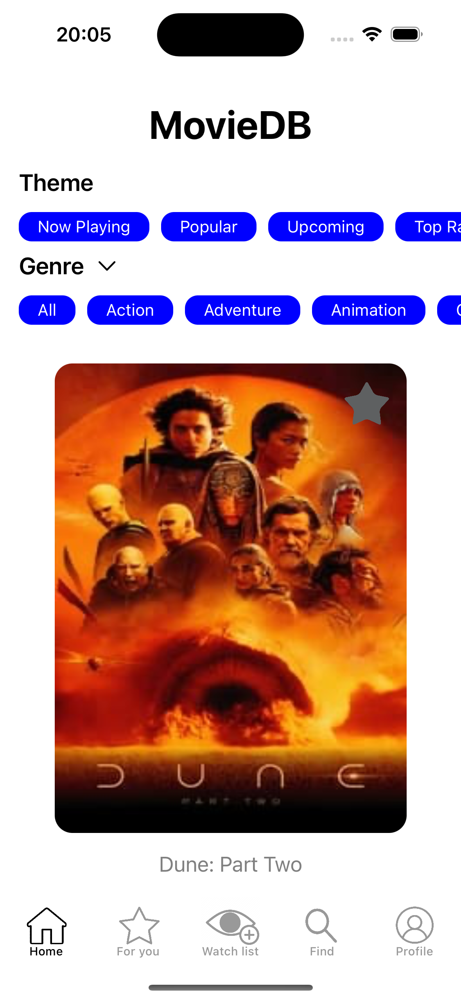
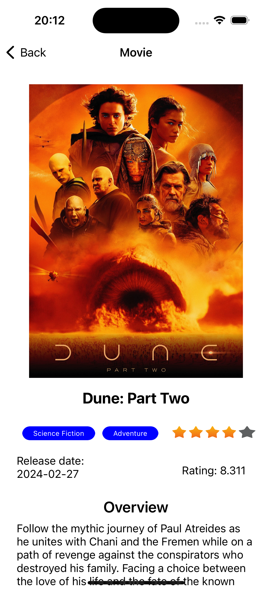

## Welcome to my project! This mobile application represents an enhanced version of IMDb, leveraging the capabilities of the TMDb API to provide comprehensive information about movies and TV shows. 

#### Functionality:
    
##### 1. Home:
The main screen serves as the central hub, allowing users to access various sections of the application.
It provides quick access to trending movies and TV shows, enabling users to stay updated on the latest entertainment trends.

##### 2. For You (Recommendations):
The "For You" section offers personalized recommendations based on users' viewing history, preferences, and behavior within the application.
By utilizing advanced algorithms, the application suggests movies and TV shows tailored to each user's unique tastes, enhancing the viewing experience.

##### 3. Watch List (Added Favorite Movies):
The Watch List feature enables users to maintain a carefully curated collection of their favorite movies and TV shows.
Users can easily add or remove items from their Watch List, allowing them to keep track of content they intend to watch or revisit.

##### 4. Search:
The search functionality allows users to find specific movies and TV shows by title.
It offers an intuitive search experience, enabling users to quickly locate desired content from the extensive database of available titles.

##### 5. Profile:
The Profile section provides users with a personalized space where they can manage their account settings and preferences.

##### Users can view their activity history, adjust notification settings, and customize their profile to reflect their individual preferences. This application aims to provide a seamless and enjoyable experience for users passionate about movies and TV shows, allowing them to easily explore, discover, and organize their entertainment content.

#### Technologies Used:
- [SnapKit](https://github.com/SnapKit/SnapKit)
- [Kingfisher](https://github.com/onevcat/Kingfisher)
- [Moya](https://github.com/Moya/Moya)
- [Alamofire](https://github.com/Alamofire/Alamofire)
